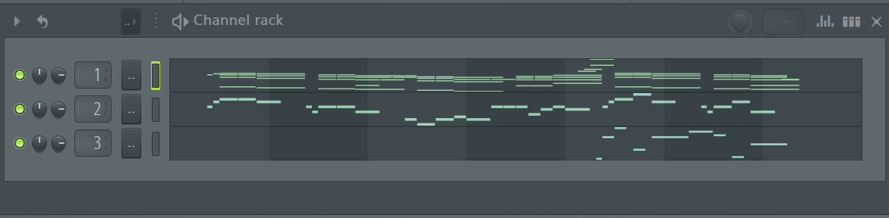
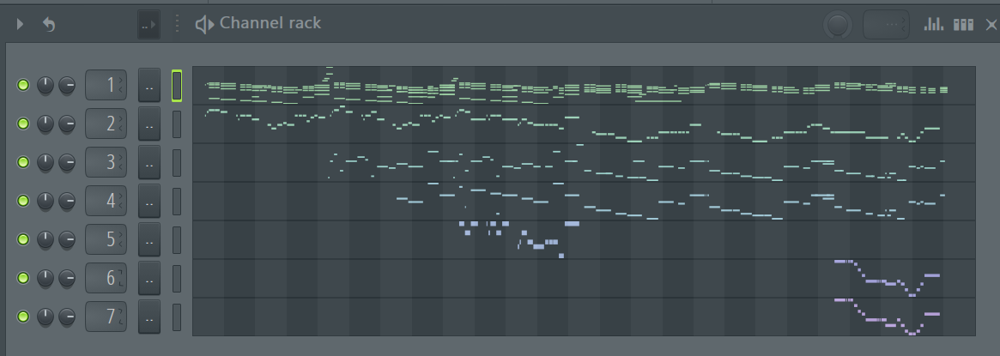

# Yinyang for MIDI

Warning: this is an outdated version of the code repo for https://github.com/music-x-lab/midi-function-alignment

## Pretrained models

You can download pretrained models at https://drive.google.com/drive/folders/1hwXuUCL0gddVwjV2gGuaaxjJ89FX7lkK?usp=drive_link

## Pretrained model auto-regressive generation

First download pretrained model ``cp_transformer_v0.42_size1_batch_48_schedule.epoch=00.fin.ckpt`` and put it in ``ckpt/``

Run ``python cp_transformer_inference.py <model_path>``

For example:
```python
python cp_transformer_inference.py ckpt/cp_transformer_v0.42_size1_batch_48_schedule.epoch=00.fin.ckpt
```

The song used in generation is hard-coded in file ``cp_transformer_inference.py``.

## Yinyang Inference

Download fine-tuned models like the following and put them in ``ckpt/``

* ``cp_transformer_yinyang_v5.1_lora_batch_8_nottingham_cp8_v2_chord_mel_mask0.0-10-step1.epoch=last.ckpt`` (chord to melody)
* ``cp_transformer_yinyang_v5.1_lora_batch_8_nottingham_cp8_v2_chord_mel_rev_mask0.0-10-step1.epoch=last.ckpt`` (melody to chord)

Run ``python cp_transformer_yinyang_inference.py <model_path>``

For example:
```python
python cp_transformer_yinyang_inference.py ckpt/cp_transformer_yinyang_v1.23_large_batch_10_nottingham_cp8_v1_chord_mel.epoch=00.val_loss=0.17502.ckpt
```

The song used in generation is hard-coded in file ``cp_transformer_yinyang_inference.py``.

In version 1, there was a smaller version of the model for testing purpose. But there is no such model in version 2.

**Example:**

Prompt



Generated result



## Yinyang Adapter

Currently we only train one-way Yinyang (i.e., to generate B conditioned on A).

First create a fine-tuning dataset and then train the Yinyang adapter

### Dataset creation

See script ``preprocess_large_midi_dataset.py`` for an example to create a **paired** dataset. E.g., to generate non-drums from drums:

```python
max_polyphony = 16  # Max allowed polyphony (number of onsets at the same time)
rwc_folder = os.path.join(RWC_DATASET_PATH, 'AIST.RWC-MDB-P-2001.SMF_SYNC')
create_npy_dataset_from_midi(rwc_folder, max_polyphony, f'rwc_cp{max_polyphony}_v2_drums_nondrum', ins_ids=['drum', 'nondrum'])
```

To generate chords (track 1 in Nottingham) from melody (track 0 in Nottingham):

```python
max_polyphony = 8
nottingham_folder = os.path.join(NOTTINGHAM_DATASET_PATH, 'MIDI')
create_npy_dataset_from_midi(rwc_folder, max_polyphony, f'nottingham_cp{max_polyphony}_v2_chord_mel', ins_ids=['track-1', 'track-0'], scan_subfolders=False)
```
You need to properly set RWC_DATASET_PATH and NOTTINGHAM_DATASET_PATH in ``settings.py``.

### Training Yinyang

Run ``python cp_transformer_yinyang.py --batch_size=<batch_size> --fp_path=<pretrained_model_path> --dataset_name=<dataset_name>``.

For example, to train a chord to melody model:

```python
python cp_transformer_yinyang.py --batch_size=8 --dataset_name=nottingham_cp8_v2_chord_mel --mask_prob=0.0 --early_stopping_patience=10
```
